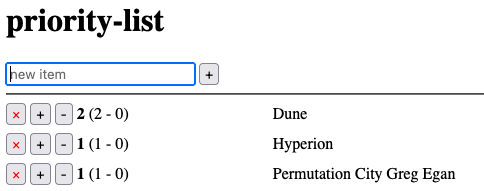

# priority-list
I just really wanted a quick and simple way to prioritize a list of things. I
want it to persist and make it easy to increase and decrease priority. This
extremely simple web app does just that.

## Screenshot

As you can see, I'm using it to prioritize my reading list.
